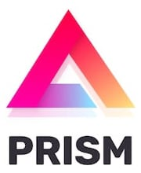
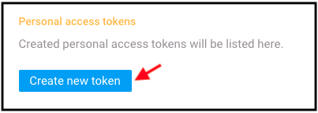
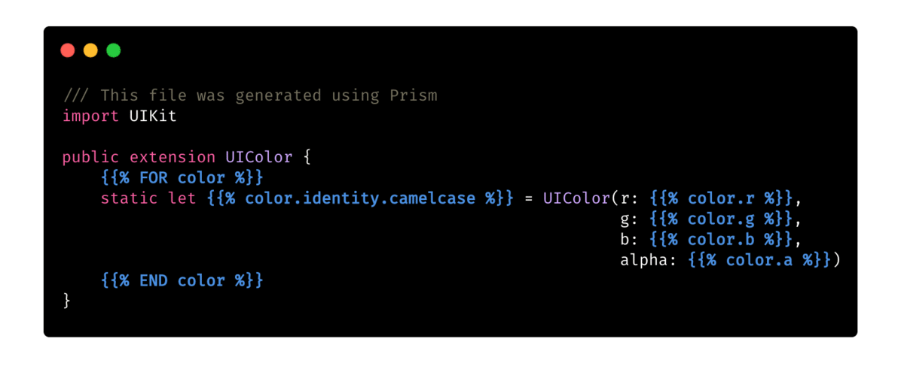
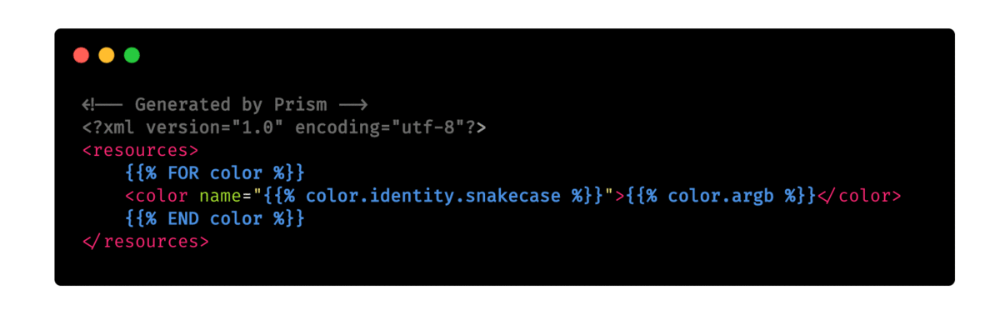

 

Prism is a Design System code generator developed by the team at Gett 🚕.

Synchronizing design teams with engineering teams is a huge challenge.

As teams scale, new growing pains start around how to properly align colors, text styles and other design details between teams, in a uniform way, from a single source of truth.

Prism was built to solve this very problem! It takes a Zeplin project as input, and generates any output code you want from a project's styleguide based on a set of templates in your project, resulting in cross-platform code that is always synchronized from a single source-of-truth (Your project's Zeplin Styleguide).

Prism is especially useful when used in your CI/CD process to remove the friction of design handoff and review, and making sure all of your teams are properly synchronized in regards to naming, values, and more.

## Getting Started

### 📹 Videos

* [A 60 seconds introduction to Prism](https://www.youtube.com/watch?v=MNcAAUji-YY)
* [Design a Design System @ Swift Heroes, Italy](https://www.youtube.com/watch?v=UFyx7EtbcMU) (25 minutes)

### 🌈 Getting Prism

There are four options: 

1. **Run with SPM**: `swift run prism generate` 
2. **Build locally**: `make` - this will build and install `prism` in **/usr/local/bin** (or run `swift build -c release` to only build without installing)
3. Use the pre-built binary attached to a release (or in the **bin** folder)
4. Install using **[Mint](https://github.com/yonaskolb/Mint)**: `mint install GettEngineering/Prism`

### 🔑 Getting a Zeplin API Token

To use Prism, you'll need to generate a Personal Access Token (JWT) to Zeplin's API by going to [https://app.zeplin.io/profile/developer](https://app.zeplin.io/profile/developer) and click the **Create new token** button in the **Personal access tokens** section:

You'll need to expose this token to run the `prism` CLI tool. Make sure you have a `ZEPLIN_TOKEN` environment variable with your token configured. 

When running `prism` in a CI environemnt, we recommend adding `ZEPLIN_TOKEN` as an Environment Secret.

When using `prism` locally or bootstrapping your project for the first time, you can simply run `export ZEPLIN_TOKEN='zeplin_personal_token'` before running `prism` locally.

### 👢 Bootstrap Prism for your Project

Inside your project folder, run `prism init`. 

It will guide you through selecting a Zeplin project as source along with other useful information for proper code generation. Once `prism init` is successful, you'll find a new `.prism` folder with a `config.yml` file outlining your preferences.

### 🎨 Creating Templates

Prism uses templates with the `.prism` suffix located in your project's `.prism` folder. These Prism templates are basically plain text files — Prism doesn't really care what format or language you use, it can make _any kind of output_ as long as you can express it in a Prism template file.

Prism looks for something called [**Tokens**](Documentation/Tokens.md) inside your templates. These tokens follow the following format: `{}`. You can find a couple of sample templates in the [Examples](https://github.com/gtforge/Prism/tree/master/Examples) folder.

Here are two short example of generating colors code for iOS and Android using Prism templates.

**Colors.swift.prism**:

**colors.xml.prism**:

    
## Development

* Run `make` or `make install` to build a release binary of the `prism` CLI tool and install it to **/usr/local/bin**.
* Run `make build` to build a release binary of the `prism` CLI tool and copy it to the **bin** folder.
* Run `make project` to create an Xcode project and start working.
* Run `make test` to run all tests.
* Run `make clean` to clear the generated Xcode project.
